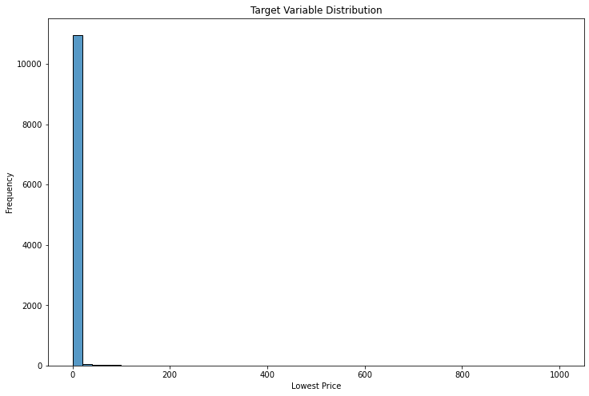
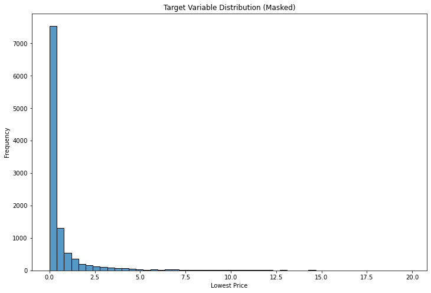
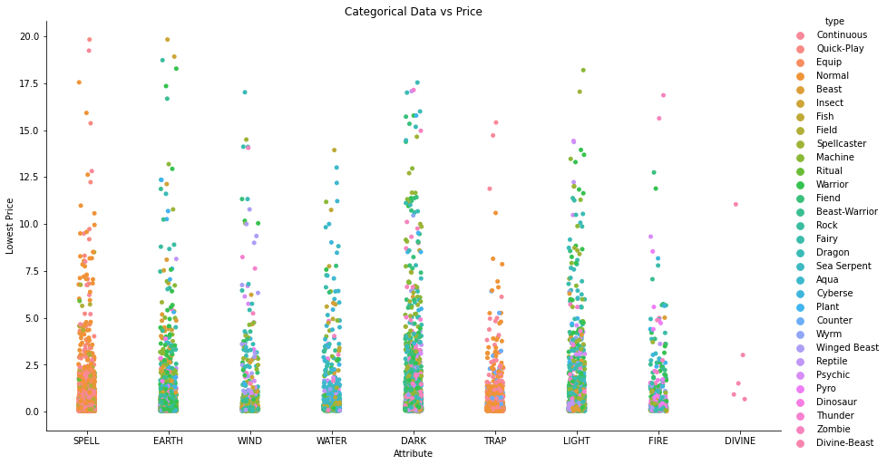
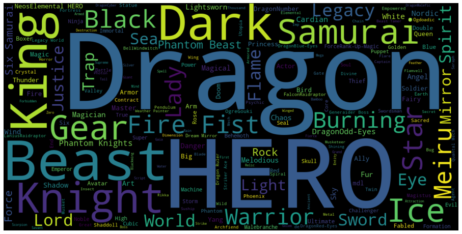
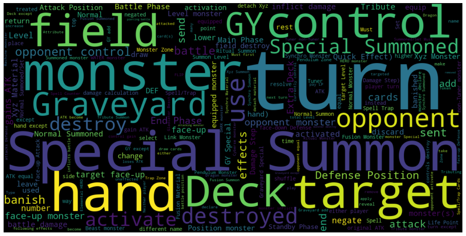

# Predicting Trading Card Prices
## Introduction
Over the course of the pandemic, crafts and hobbies saw an increase in popularity as many people stuck at home looked back fondly on their childhood pastimes. Now armed with greater financial firepower, new and returning enthusiasts have altered the market for collectibles such as trading cards.

The initial aim of this project was to build a model for predicting trading card prices across multiple TCGs (trading card games), however it ended up being more effective to stick to just one, Yu-Gi-Oh!. As a dataset Yu-Gi-Oh! offers several benefits for data science such as all card text being written in a very specific way to try and improve clarity and having all cards always being playable in the actual game (other TCGs use 'set rotation' wherein only cards printed recently are legal). The intention was that the model (if good enough) could be used to predict the more valuable cards in a newly released set, information which could then be used by buyers and collectors to work out what to buy.

## Repository Contents

| Section  | Contents |
| ------------- | ------------- |
| Data Collection  | The initial acquisition of the data for this project and some basic cleaning performed in order to create a csv file (also includes the data dictionary) |
| EDA  | The major data cleaning performed and thorough exploratory data analysis of the dataset  |
| Modelling| Vectorisation of all the text data and all the models initially ran in order to choose models for optimisation  |
| Summary and Overview | An executive summary of the project that leads into highlights from the EDA and Modelling sections followed by model optimisation and analysis  |

## Data Acquisition and Initial Cleaning
Originally all data was going to be sourced through the API of [TCGPlayer](https://docs.tcgplayer.com/docs) but unfortunately there was not much recent support for using it (NB if support becomes available this project will most likely be overhauled to make use of it). As a result, I instead used a community run database to source all the data [YGOPRODeck](https://db.ygoprodeck.com/api-guide/), this site was extremely helpful for me as it provided much of the domain knowledge that I otherwise lacked, having not collected these cards for nearly 20 years (NB At the same time as accessing the card database through their API, I also accessed information regarding all the sets released for the game so that I can use that data for potential future projects). While gathering this data, I added a few extra features from the database that I thought might be interesting, namely the ban status of a card in the game and whether the community considered it a staple in the game (essentially a card that is very powerful and very often worth using).

The initial basic cleaning performed here involved dropping duplicates or missing values while also making sure that all the entries were for the TCG rather than the OCG (official card game, which is what the Japanese version of the game is called and is slightly different to the game in the rest of the world). During this process a few other incorrect values were also identified and corrected to what they should be, with one of the first major pieces of feature engineering performed being to set the attribute for all spell and trap cards to be spells or traps respectively (technically this is not how they are defined by the game but it makes sense for analysis).

The csv file created at the end of this process is the base from which the rest of the project is built and while many features of it are explained well in the API documentation for YGOPRODeck I have also created a [data dictionary](DataCollection/TCGDataDictionary.txt) that exists in the same folder. All subsequent features engineered are built from the ones in this dictionary and explained at their point of creation.

## Feature Engineering and Exploratory Data Analysis

In this section of the project, data cleaning was continued resulting in several features possessed by very few cards (for example only ~300 link monsters have link arrows) being removed from the dataset and visualisations performed for the majority of features (the entirety of this can be found in the [EDA notebook](EDA/CapstoneEDA.ipynb).

During this process, it became apparent that the dataset was extremely skewed in shape:

As a result, I decided to use a mask on the dataset that removed any prices above $20. This threshold was chosen because it only removed 100 entries from the dataset while making the target variable much more usable. Although a more drastic threshold could have been chosen to make the data normally distributed (as well as techniques such as sampling), the intent of the project is to identify these outlier types of cards rather than predicting what might make a card tiny fractions of a financial unit more valuable.

Further efforts involved resolving columns highly correlated with each other where possible (for example the number of times a card had been viewed in the database was extremely correlated with the number of views it had received in the past week), as well as simplifying some columns down (for example the “kind” column was simplified into a binary indicator if a card goes in the main or extra deck) and then dummifying the other categorical features. Ultimately the majority of decisions made followed the general sense of how the data was stored in the original database. What became apparent as the cleaning and EDA continued was that the data was very diverse containing masses of different features all having a small impact on the target variable, this is best demonstrated in this graphic which demonstrates just two of the 20+ features against the target variable:

The final piece of feature engineering was the most drastic carried out involving the rarities and printings of each card. Up to this point, I had still been hoping to be able to use the TCGPlayer API as it provides data for every printing of every card (making the dataset roughly 3 times larger) rather than the dataset that was used which only provides pricing data for the cheapest version available of each card. As a result, I had to assume that the cheapest printing of each card corresponded to its lowest rarity and then research all the rarities so that I could rank them from lowest to highest (unfortunately there is no absolute ranking for this). This all was done whilst keeping all the set codes and rarities synced for each card for potential future use. The assumptions made here are arguably the largest made in the entire project but there really does not seem a better approach than this at present. 

### Natural Language Processing

The last thing to do before starting to run models was to decide how to handle the text data and the NLP methods to use, this is covered in the [Modelling notebook](Modelling/Models.ipynb) although the visualisations of the data take place in the EDA notebook. In the process of handling this data, I decided to also limit the cards to only those that had an effect as the text printed on them rather than a description (this actually only removes ~300 cards from our near 11000 dataset while improving what we might achieve with NLP).

In the dataset, there are two text features to consider. First, the name of each card (these names often define cards as part of an archetype) and secondly, the effect text of each card (Yu-Gi-Oh! uses PSCT (problem solving card text) a set of rules for making text logically interpretable). In theory, both these textual aspects should have the potential to work strongly with data science techniques. We can get an idea of each feature by examining word clouds created from them:

Unsurprisingly, the name cloud is dominated by common words in card names such as “king”, “dragon” and “knight”, although it demonstrates the presence of archetypes well since HERO is very prominent in the cloud and one of the largest archetypes in the game (there are naturally also several dragon and knight archetypes as well).

This cloud highlights several of the aspects of the game with “turn” being extremely prominent (unsurprising as the game is turn based) many effects being targeting effects (hence “target”), “special summon” being a fairly powerful common effect and most major areas that cards can be also featuring (“graveyard”/”GY”, “hand”, “field”, “deck”).

One of the most important things heading into the actual NLP was to decide on custom RegEx to use in order to take advantage of PSCT and also make sure all archetypes are collected properly since the standard RegEx pattern used by most packages ignores punctuation which is very important in PSCT and also integral to archetype names such as D/D/D and D.D. being differentiated. The patterns I used were r"\w[\w'\"()\@\-/]+" for names and r"\w[\w'()\@\-/]+" for effects (speech marks do not matter in card text whereas there are a few card names that use them). These patterns capture everything I could find although in such a large dataset there may still be some things missing that could be caught with improvements.

The NLP itself was performed with a count vectorizer. This was chosen ahead of a tf-idf vectorizer because, due to PSCT generalising the language used, we are less interested in identifying unique words and there is no point punishing common words for example for being part of one of the larger archetypes (arguably we want the exact opposite of what the tf-idf offers). The ngrams used were up to 3 for the names (to try and capture as many archetype names correctly as possible) and up to 2 for the effects (to try and capture technical terms such as 'Quick Effect:'), I also set the minimum frequencies for names to 5 and effects to 10 both to put a limit on how many features the NLP might produce and to focus on trying to take advantage of common features indicating archetypes or powerful effects. The end results were very similar to the initial word clouds with only a few differences likely due to the way that the word clouds are rendered.

## Modelling

The models run for this project start in the [Modelling notebook](Modelling/Models.ipynb) and the top performers among them are then optimised in the [Overview notebook](SummaryAndOverview/ExecutiveSummaryandOverview.ipynb). The data was split into training and testing data and then scaled using a standard scaler (the option of a minmax scaler is available in the overview notebook although running all the models with both scalers takes several days). These preparations are quite important because several models chosen only accept scaled data and the test score is the evaluation metric we are most interested in since we want to predict the prices for data that has not been seen before. Additionally, as might have already been apparent from the graphs above, unlike a standard linear regression problem, the target data is not normally distributed. This makes building a predictive model from it very difficult and is why I started out by trying more than 20 different models. Some of these were chosen simply because they are commonly used and others because they were the ones recommended when I researched models for non-normally distributed linear regression.

The most successful models ended up being those that I chose specifically for this task and several of the ensemble models that tend to outperform standard models on irregular data due to running many submodels. In the end, I moved into the optimisation stage with the Lars and Tweedie models from amongst the standard regression models, and the Bagging, Random Forest and Gradient Boosting ensemble regressors (also a dummy model was used to provide a baseline to compare these models with, although it really struggled to score well). The standard regression models used here work well for two different reasons. The Lars works well because it is designed for datasets with large numbers of features (something that the NLP produced a lot of). The Tweedie works well because rather than basing itself on the normal distribution, it uses the Tweedie distribution which is very asymptotic just like the distribution of the target variable (NB that by default the Tweedie family of models use D^2 as their scoring metric rather than r^2 thus I have used sklearn's metrics package to calculate their r^2 scores and make them comparable).

After applying gridsearches to this selection of models, the best test scores they achieve (to 4 s.f.) are as follows:

| Model  | Test Score (r^2) |
| ------------- | ------------- |
| Dummy  | -0.0001  |
| Lars  | 0.1506  |
| Tweedie  | 0.1510  |
| Bagging  | 0.1597  |
| Random Forest  | 0.1715  |
| Gradient Boosting  | 0.1375  |

Interestingly, the gridsearch for several of these models was unable to produce a better result than the initial model likely because it focuses on optimising the cross validated score rather than the test score leading to the model overfitting the training data. Overall, the results are not particularly big but do significantly outperform the woeful baseline score of -0.0001 which is a positive. Also, almost all these models have certain rarities amongst their most significant features (specifically ultra rare - the most common high rarity - as one of the biggest price increases and common - the lowest rarity - as one of the biggest price decreases). The other feature that has significant influence on almost every model is the number of views the card has received recently. All these factors seem fairly logical indicators of value but it is clear that our data is held back by the limitations leading to assumptions on rarity earlier.

## Conclusions

Although the models produced can outperform the baseline significantly, it is unlikely that they are usable in reality due to their low scores. Ideally, in the future, the project would be rebuilt using data acquired directly from the TCGPlayer API that would remove some of the assumptions made for the dataset and also remove the resulting limitations. Further data available through that API that would also help the models includes card quality (e.g. mint) and even past sales data for cards allowing for some time series analysis. 

Despite the limitations, the project overall offers a very interesting dataset and challenge that expanded my abilities with several data cleaning and visualisation tools such as RegEx and word clouds, while also introducing me to many new models specifically designed to deal with the problems that real data sometimes presents. There is plenty of scope for future ideas with this dataset, some based in obtaining additional data and then predicting new aspects such as whether a card belongs to an archetype or trying to map how cards can interact. Other simpler options include trying to improve the NLP using custom stop words and a stemmer or even just making the problem a classification of whether a card has a price above a certain value or not.
